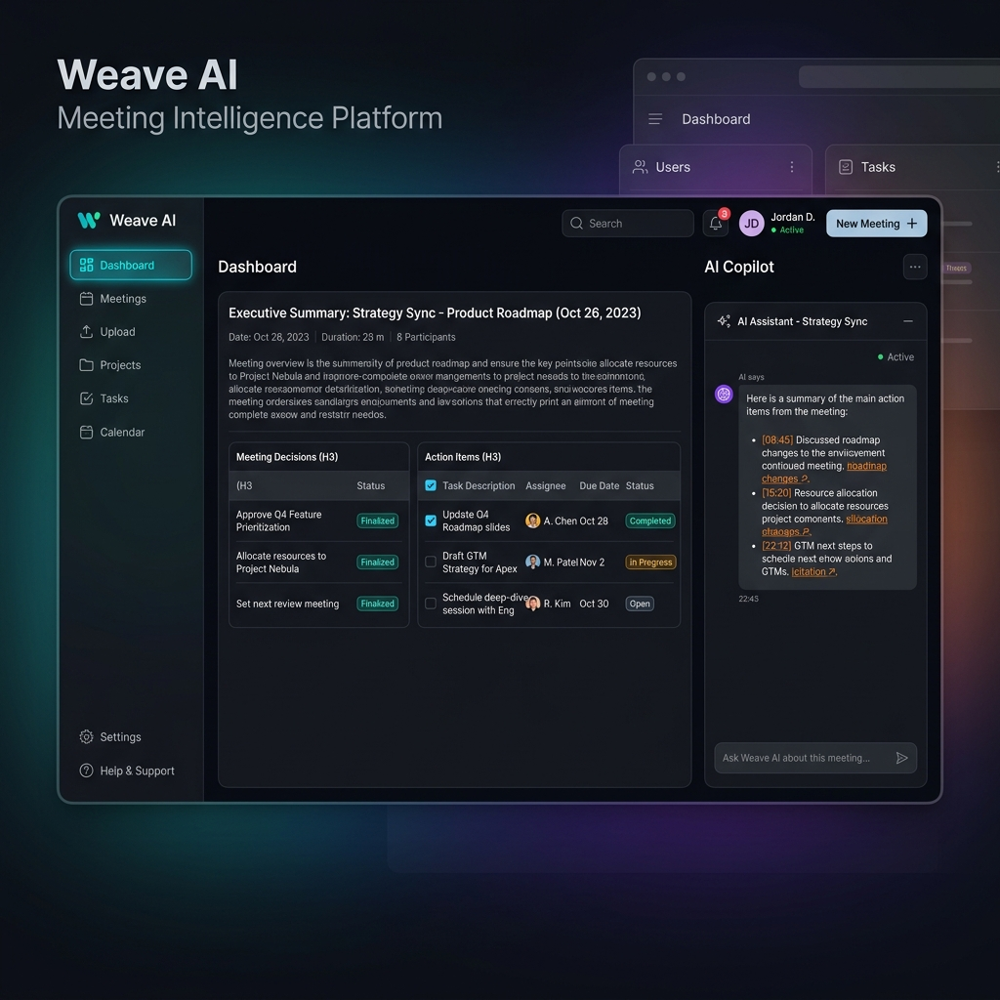
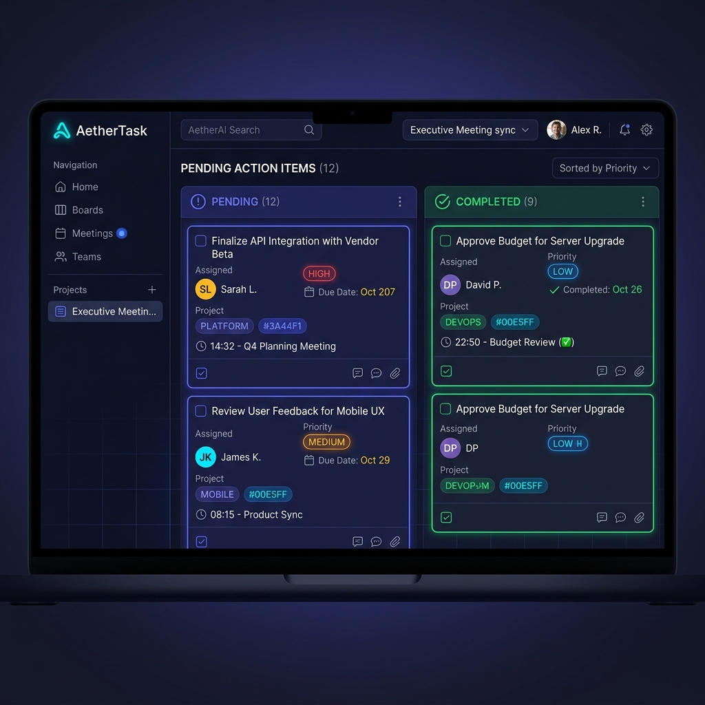
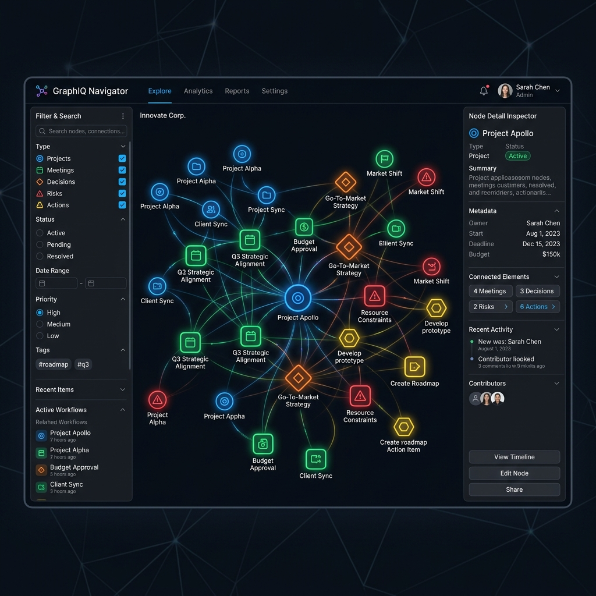
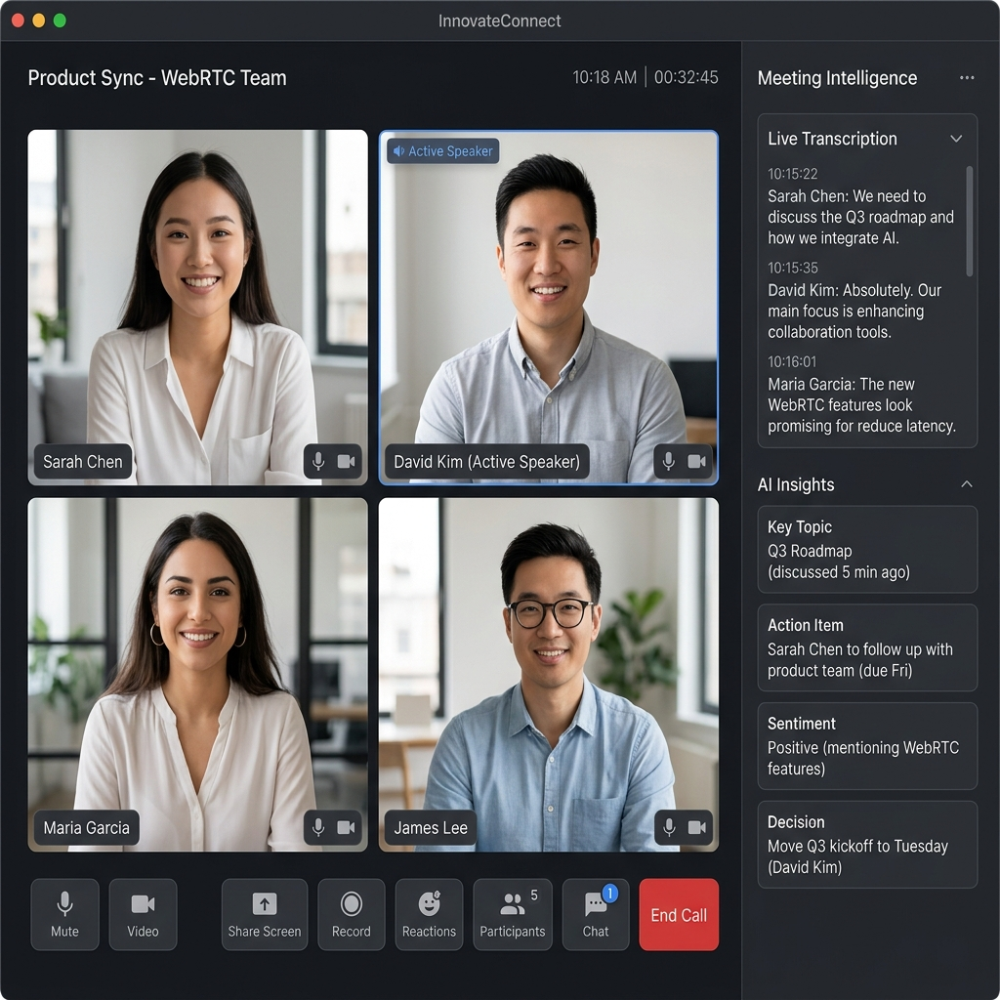
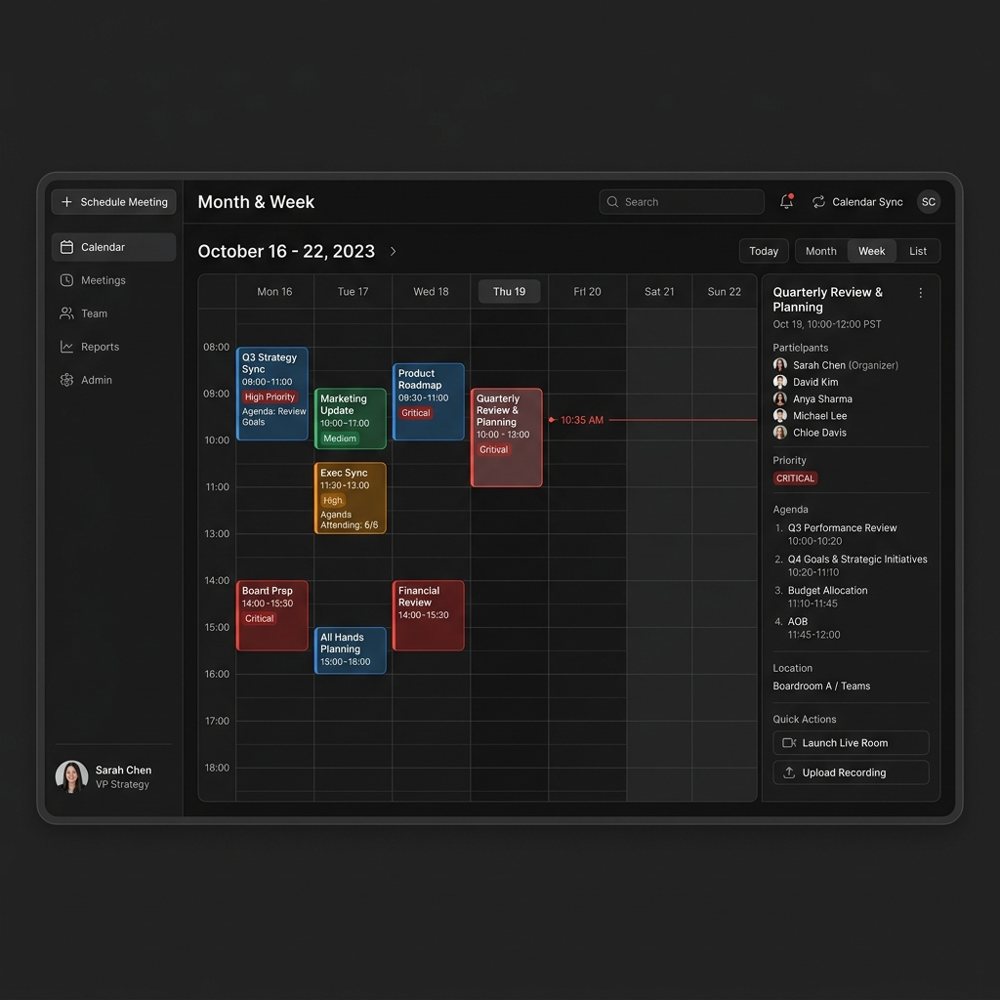

# Weave | Enterprise AI Meeting Intelligence Platform

> Enterprise B2B SaaS platform transforming post-meeting recordings, YouTube videos, and live WebRTC calls into structured business intelligence, automated action items, and conversational RAG analytics.

[](https://nextjs.org/)
[](https://react.dev/)
[](https://www.typescriptlang.org/)
[](https://neon.tech/)
[](https://tailwindcss.com/)
[](LICENSE)

---

## Table of Contents

- [Overview](#overview)
- [Key Features](#key-features)
- [Screenshots and Demo](#screenshots-and-demo)
- [Tech Stack](#tech-stack)
- [Project Structure](#project-structure)
- [Prerequisites](#prerequisites)
- [Installation and Setup](#installation-and-setup)
- [Environment Variables](#environment-variables)
- [Usage Instructions](#usage-instructions)
- [API Documentation](#api-documentation)
- [Testing and Verification](#testing-and-verification)
- [Chrome Extension Setup](#chrome-extension-setup)
- [Roadmap](#roadmap)
- [Contributing](#contributing)
- [License](#license)
- [Author and Contact](#author-and-contact)

---

## Overview

Meetings generate vast amounts of unstructured dialogue, leading to lost decisions, forgotten action items, and manual administrative overhead. 

**Weave** is a multi-tenant SaaS application that automates the entire meeting lifecycle. Users can upload raw meeting media (`.mp4`, `.mov`, `.m4a`, `.mp3`, `.wav`), submit YouTube video URLs, or host real-time video calls directly inside built-in WebRTC rooms. 

The underlying pipeline processes audio into 16kHz PCM WAV format via static FFmpeg binaries, transcribes dialogue using local ONNX Whisper models or cloud APIs, auto-classifies content types, extracts structured intelligence, indexes transcript chunks into an in-memory TF-IDF vector RAG engine, and persists records in serverless Neon PostgreSQL.

---

## Key Features

- **3-Panel SaaS Workspace:** Left navigation sidebar, dual-tab center content panel (Summary and Full Transcript), and right AI Copilot widget with timestamp citations (`Source: [MM:SS]`).
- **Multi-Source Media Ingestion:** Ingests local media containers (`.mp4`, `.mov`, `.m4a`, `.mp3`, `.wav`) and YouTube video URLs with caption extraction and Whisper audio fallback.
- **High-Precision Speech-to-Text:** Converts audio into 16kHz 16-bit mono PCM WAV using static FFmpeg binaries, producing formatted dialogue with exact timestamps (`[MM:SS]`) and speaker labels (`Speaker 1`, `Speaker 2`).
- **Multi-Language Support:** Supports English (`en`), Hindi (`hi`), Telugu (`te`), and automatic language detection.
- **Content-Type Auto-Classification:** Automatically categorizes audio into Business Meetings, Lectures or Study Sessions, Coding Syncs, Podcasts, or General discussions.
- **Specialized Artifact Generation:**
  - *Lectures:* Generates Flashcards, Interactive Quizzes, and Mindmaps.
  - *Coding Syncs:* Generates Technical Code Guides, API lists, Library mentions, and Shell Commands.
  - *Podcasts:* Extracts Key Insights, Timeline breakdowns, and Resource links.
- **Automated Executive Intelligence:** Extracts high-level summaries, key discussion themes, formal decision logs, action item matrices with assignees and due dates, and severity-rated risk warnings.
- **Speaker Analytics and Efficiency Metrics:** Calculates speaker talk-time percentages, word counts, overall meeting efficiency scores (0 to 100), and unresolved question logs.
- **Dual-Layer Vector RAG Engine:** Supports single-meeting RAG chat and organization-wide cross-meeting memory chat grounded in stored TF-IDF vector embeddings.
- **Built-in WebRTC Live Meeting Rooms:** Real-time video conferencing powered by LiveKit with live microphone and camera capture, chunk transcription, streaming insights, and live AI assistance.
- **Project Intelligence Workspaces:** Group related meetings into projects to automatically aggregate project objectives, completion percentages, active blockers, and priority timeline flows.
- **Interactive Knowledge Graph Explorer:** Visualizes relationships between projects, meetings, decisions, risks, and task dependencies in an interactive network graph.
- **Scheduled Meeting Calendar:** Month, Week, and Day calendar views for scheduling upcoming meetings with agendas, duration, attendees, priority tags, and automated status syncing.
- **Global Task Execution Board:** Centralized Kanban and list management board for cross-meeting action items with status toggles, assignee filters, due dates, and direct timestamp citations back to exact transcript lines.
- **Centralized Decisions Log:** Unified repository aggregating all historical decisions made across all meetings with decision-maker attributions and background context.
- **Chrome Manifest V3 Extension:** Side-panel browser assistant for live recording, real-time transcription, and live chat alongside Google Meet or Zoom calls.

---

## Screenshots and Demo

### 1. 3-Panel SaaS Workspace

*Centralized 3-panel workspace displaying executive summary, interactive action item matrix, decisions log, and grounded AI copilot chat.*

---

### 2. Global Task Management Board

*Centralized cross-meeting task execution board with status filters, assignee tags, priority badges, and direct transcript citations.*

---

### 3. Interactive Knowledge Graph Explorer

*Interactive network graph mapping relationships between projects, meetings, decisions, and action items.*

---

### 4. Built-in WebRTC Live Meeting Room

*Real-time LiveKit video conferencing room featuring active speaker grid, live speech transcription stream, and streaming AI assistant.*

---

### 5. Scheduled Meeting Calendar

*Executive calendar scheduler providing Month, Week, and Day views with priority badges and agenda tracking.*

---

## Tech Stack

| Category | Technologies / Libraries |
| :--- | :--- |
| **Framework** | Next.js 16.2.11 (App Router, Turbopack), React 19.2.4, TypeScript 5.0 |
| **Styling** | Vanilla CSS, Tailwind CSS 4.0, PostCSS, Lucide React Icons |
| **Audio Converter** | `ffmpeg-static` (16kHz PCM WAV extraction), `fluent-ffmpeg` |
| **Speech Recognition** | ONNX Local Whisper (`@xenova/transformers`), OpenAI Whisper API, Groq API |
| **AI Analytics** | NVIDIA Nemotron / NIM API (`NVIDIA_API_KEY`), LlamaCloud API (`LLAMA_API_KEY`), Anthropic Claude 3.5 Sonnet, OpenAI SDK |
| **Database** | Serverless Neon PostgreSQL (`pg` connection pooler with SSL) |
| **Vector Engine** | Custom In-Memory TF-IDF Vector Index & Cosine Similarity Search |
| **Real-time WebRTC** | LiveKit WebRTC (`@livekit/components-react`, `livekit-client`, `livekit-server-sdk`) |
| **Media Ingestion** | `youtube-transcript`, `yt-dlp-exec` |
| **Chrome Extension** | Manifest V3 (Side Panel, Content Scripts, Background Worker) |

---

## Project Structure

```
AI-Meeting-Intelligence-Platform/
├── app/                        # Next.js App Router root directory
│   ├── api/                    # Serverless REST API endpoints
│   │   ├── auth/               # User authentication (register, login, logout, me)
│   │   ├── chat/global/        # Organization-wide cross-meeting RAG chat
│   │   ├── live-meetings/      # Live meeting state management
│   │   ├── livekit/token/      # WebRTC room token generation
│   │   ├── meetings/           # Single meeting CRUD and RAG chat
│   │   ├── projects/           # Project workspace endpoints
│   │   ├── tasks/              # Global task management endpoints
│   │   ├── transcribe-chunk/   # Real-time live audio chunk STT
│   │   └── upload/             # Media file and YouTube URL ingestion API
│   ├── components/             # Reusable UI components (LanguageSelect)
│   ├── dashboard/              # 3-Panel SaaS Workspace pages
│   │   ├── calendar/           # Scheduled meeting calendar
│   │   ├── chat/               # Organization-wide AI copilot
│   │   ├── decisions/          # Cross-meeting decision log
│   │   ├── graph/              # Interactive knowledge graph explorer
│   │   ├── live/               # WebRTC Live Meeting video room
│   │   ├── meeting/            # Meeting detail view (insights and transcript)
│   │   ├── meetings/           # Meeting list view
│   │   ├── projects/           # Project workspace management
│   │   ├── settings/           # User settings
│   │   ├── tasks/              # Global task execution board
│   │   └── upload/             # Media file and YouTube URL uploader
│   ├── join/                   # Guest live meeting join page
│   ├── login/                  # User authentication login and register page
│   ├── globals.css             # Global Tailwind CSS and SaaS styling
│   ├── layout.tsx              # Root HTML layout wrapper
│   └── page.tsx                # SaaS dashboard landing page
├── docs/                       # Documentation assets
│   └── screenshots/            # UI screenshots referenced in README
├── extension/                  # Chrome Manifest V3 extension directory
├── lib/                        # Core backend engines and utility services
│   ├── auth.ts                 # JWT session validation and password hashing
│   ├── classify.ts             # Content-type auto-classification engine
│   ├── db.ts                   # Neon PostgreSQL connection pool and migrations
│   ├── extract.ts              # Structured intelligence LLM extraction pipeline
│   ├── liveChat.ts             # Real-time live meeting AI assistant
│   ├── liveMeetingStore.ts     # In-memory live meeting state store
│   ├── llamaCloud.ts           # LlamaCloud API extraction client
│   ├── projectIntelligence.ts  # Multi-meeting project aggregator engine
│   ├── rag.ts                  # In-memory TF-IDF vector RAG engine
│   ├── whisper.ts              # Local ONNX and cloud Whisper STT pipeline
│   └── youtube.ts              # YouTube caption fetch and fallback pipeline
├── .env.example                # Template for environment configuration
├── next.config.ts              # Next.js framework configuration
├── package.json                # Project dependencies and npm scripts
└── tsconfig.json               # TypeScript compiler configuration
```

---

## Prerequisites

Before setting up the project locally, ensure you have installed:

- **Node.js:** `v18.x` or higher
- **npm:** `v9.x` or higher
- **Git:** Version control CLI

---

## Installation and Setup

### 1. Clone the Repository

```bash
git clone https://github.com/CHHARSHITHAREDDY/AI-Meeting-Intelligence-Platform.git
cd AI-Meeting-Intelligence-Platform
```

### 2. Install Dependencies

On Windows operating systems, execute the installation with postinstall script bypass to avoid native compiler dependencies:

```bash
cmd /c npm install --ignore-scripts
```

On Linux or macOS systems, standard installation can be executed:

```bash
npm install
```

### 3. Configure Environment Variables

Create a `.env.local` file in the project root directory using `.env.example` as a template:

```bash
cp .env.example .env.local
```

Fill in your database credentials and API keys inside `.env.local`.

---

## Environment Variables

| Variable Name | Required / Optional | Description |
| :--- | :--- | :--- |
| `DATABASE_URL` | **Required** | Neon Serverless PostgreSQL connection URL string with SSL enabled. |
| `JWT_SECRET` | **Required** | Secret key string used for signing user authentication JWT tokens. |
| `NVIDIA_API_KEY` | Recommended | NVIDIA Nemotron API key for structured intelligence extraction. |
| `LLAMA_API_KEY` | Recommended | LlamaCloud API key for structured intelligence extraction. |
| `ANTHROPIC_API_KEY` | Optional | Anthropic API key for Claude 3.5 Sonnet extraction fallback. |
| `OPENAI_API_KEY` | Optional | OpenAI API key for cloud Whisper transcription fallback. |
| `GROQ_API_KEY` | Optional | Groq API key for fast cloud Whisper transcription fallback. |
| `WHISPER_MODEL` | Optional | ONNX model identifier (defaults to `Xenova/whisper-base`). |
| `LIVEKIT_URL` | Optional | WebRTC LiveKit server WebSocket URL for live video calls. |
| `LIVEKIT_API_KEY` | Optional | WebRTC LiveKit API key for live video room token generation. |
| `LIVEKIT_API_SECRET` | Optional | WebRTC LiveKit API secret key. |
| `PORT` | Optional | Server port number (defaults to `3000`). |

---

## Usage Instructions

### Run Development Server

Start the local Next.js development server with Turbopack enabled:

```bash
cmd /c npm run dev
```

Open [http://localhost:3000](http://localhost:3000) in your web browser to access the application.

### Build Production Bundle

To compile and verify the production bundle:

```bash
cmd /c npm run build
```

### Start Production Server

To start the production server after building:

```bash
cmd /c npm start
```

### Run Linter

To run ESLint code analysis across the codebase:

```bash
cmd /c npm run lint
```

---

## API Documentation

The platform provides a serverless REST API structured across key resource modules:

| Endpoint | Method | Description |
| :--- | :--- | :--- |
| `/api/auth/register` | `POST` | Registers a new user account with hashed password credentials. |
| `/api/auth/login` | `POST` | Authenticates user credentials and issues a signed JWT session cookie. |
| `/api/auth/logout` | `POST` | Invalidates the active JWT user session cookie. |
| `/api/auth/me` | `GET` | Retrieves authenticated profile data for the current session user. |
| `/api/upload` | `POST` | Ingests raw audio files, video files, or YouTube URLs for transcription and extraction. |
| `/api/meetings` | `GET` | Fetches meeting lists filtered by user session, date range, or project ID. |
| `/api/meetings/[id]` | `GET`, `DELETE` | Retrieves complete meeting payload or deletes a meeting record. |
| `/api/meetings/[id]/chat` | `POST` | Contextual RAG vector search query against a specific meeting transcript. |
| `/api/projects` | `GET`, `POST` | Lists all projects or creates a new project workspace. |
| `/api/projects/[id]` | `GET`, `DELETE` | Retrieves project metrics and intelligence aggregation or deletes a project. |
| `/api/tasks` | `GET`, `POST` | Lists global tasks with status/due date filters or creates a manual task. |
| `/api/tasks/[id]` | `PATCH`, `DELETE` | Updates task status, assignee, priority, due date, or deletes a task. |
| `/api/chat/global` | `POST` | Organization-wide vector RAG search across all stored meeting transcripts. |
| `/api/live-meetings` | `GET`, `POST` | Lists active live meetings or creates a new live meeting session room. |
| `/api/live-meetings/[id]` | `GET`, `PATCH` | Fetches live meeting state or streams live transcript and insights updates. |
| `/api/transcribe-chunk` | `POST` | Transcribes real-time audio PCM chunks for live meeting rooms. |
| `/api/livekit/token` | `POST` | Issues WebRTC room authentication tokens for LiveKit video calls. |

---

## Testing and Verification

While no automated test runner (such as Jest or Vitest) is configured in package dependencies, verification is conducted using empirical runtime validation:

1. **Database Schema Verification:** On startup, `initDb()` in [lib/db.ts](lib/db.ts) connects to Neon PostgreSQL and verifies that required tables (`users`, `projects`, `meetings`, `tasks`) and columns exist.
2. **Build Compilation Check:** Executing `npm run build` verifies TypeScript static typing and Next.js bundle compilation.
3. **Runtime Server Verification:** Accessing `http://localhost:3000` verifies that API endpoints return proper status codes (200 OK for valid sessions, 401 for unauthenticated requests).

---

## Chrome Extension Setup

The repository includes a standalone Manifest V3 Chrome Extension located in the `/extension` directory for side-panel assistant integration during live Google Meet or Zoom calls.

### Installation Steps

1. Open Google Chrome and navigate to `chrome://extensions/`.
2. Enable **Developer Mode** using the toggle in the top-right corner.
3. Click **Load Unpacked** in the top-left navigation menu.
4. Select the `extension/` folder located in this repository.
5. Open any Google Meet or Zoom tab, click the extension icon, and launch the Live Side-Panel Assistant.

---

## Roadmap

- [ ] **Multi-Speaker Diarization:** Enhanced speaker identification using voice embedding models.
- [ ] **Automated Integration Connectors:** Direct sync plugins for Jira, Linear, Trello, and Slack.
- [ ] **Export Options:** One-click export of MOM documents to PDF, Notion, and Markdown formats.
- [ ] **Offline Transcription Worker:** Local GPU accelerated Whisper inference backend option.

---

## Contributing

Contributions are welcome! Please follow these steps to contribute:

1. Fork the repository on GitHub.
2. Create a new topic branch (`git checkout -b feature/amazing-feature`).
3. Commit your changes with descriptive commit messages (`git commit -m 'Add amazing feature'`).
4. Push your branch to GitHub (`git push origin feature/amazing-feature`).
5. Open a Pull Request for review.

---

## License

This project is licensed under the [MIT License](LICENSE).

---

## Author and Contact

Developed for the AI Meeting Intelligence SaaS Hackathon.

- **GitHub Repository:** [CHHARSHITHAREDDY/AI-Meeting-Intelligence-Platform](https://github.com/CHHARSHITHAREDDY/AI-Meeting-Intelligence-Platform)
- **Issue Tracker:** [GitHub Issues](https://github.com/CHHARSHITHAREDDY/AI-Meeting-Intelligence-Platform/issues)
